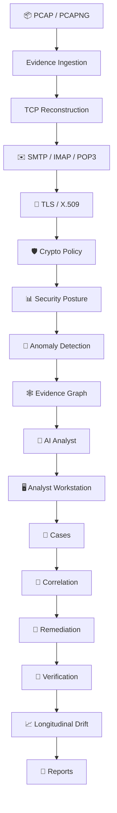
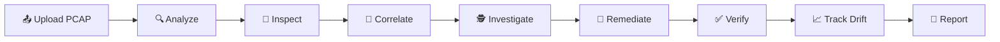

<div align="center">

# 📧 NS-Email

### SecureMailScope — AI-Assisted Cryptographic Security Posture Assessment for Secure Email Communications

*Passive PCAP forensics for real email traffic — reconstruct it, score its crypto, track it over time.*

**[📖 User Guide](docs/USER_GUIDE.md) · [🚀 Quick Start](#-quick-start) · [🎬 Demo](#-quick-start) · [🏗️ Architecture](docs/architecture/README.md) · [📏 Evaluation](docs/evaluation/README.md)**

`Python 3.12+` · `Next.js` · `SQLite` · `Docker ready` · `MIT` · `Offline capable`

</div>

---

<div align="center">

Compliance scanners test endpoints on demand.
**NS-Email answers the harder question: what actually happened to real email traffic on the wire** — reconstructed passively from captured packets, with every conclusion tied to forensic evidence.

</div>

## ✨ What it does

| Capability | Description |
| --- | --- |
| 📦 PCAP Forensics | Validated PCAP/PCAPNG ingestion with SHA-256 identity, magic-byte checks, and deterministic capture ids |
| 🔬 Protocol Reconstruction | TCP stream reassembly plus SMTP / IMAP / POP3 session forensics with STARTTLS tracking |
| 🔐 TLS / X.509 Analysis | Versions, ciphers, key exchange, SNI/ALPN, certificate chains, validity, signatures, fingerprints |
| 🛡️ Crypto Policy | 15 deterministic rules with severity, confidence, evidence references, and remediation guidance |
| 📊 Security Posture | Explainable 0–100 score per capture with factors, host/protocol views, and priorities |
| 🧠 Anomaly Detection | Local IsolationForest over session features — statistical outliers, never attack labels |
| 🕸️ Evidence Graph | Interactive graph of sessions, certificates, TLS configurations, findings, and anomalies |
| 🤖 AI Analyst | Evidence-grounded answers with citations; mock, Ollama, or OpenAI-compatible providers |
| 📁 Case Management | Multi-capture investigations with notes, tags, bookmarks, timelines, and reports |
| 🔗 Correlation | Deterministic shared-evidence relationships across a case's captures |
| 🔧 Remediation | Analyst plans with an explicit state machine, ownership, and timeline |
| 🔄 Verification | Evidence-based or manual verification of a rule against a later capture |
| 📈 Drift Analysis | Baselines, posture trends, finding lifecycles, configuration drift, regression detection |
| 📑 Reporting | Deterministic JSON / HTML / PDF reports for captures and cases, plus exports and bundles |

## 🏗️ How it flows



> One FastAPI backend · one analysis engine · one Next.js frontend · one SQLite store — no microservices, no queues, easy to run locally and demonstrate. Details: [docs/architecture/README.md](docs/architecture/README.md).

## 💡 Why NS-Email?

- **Passive evidence, not active probing.** No logins, no test emails, no scanning — analysis reads captures you provide.
- **Explainable by construction.** Every finding cites packets; every score shows its formula; the UI explains each calculation.
- **Deterministic core.** Same evidence plus same policy yields byte-identical output. AI assists; it never decides.
- **Grounded AI.** Minimized structured context, validated citations, explicit uncertainty — and a mock provider for fully offline work.
- **Investigation workflow.** Cases, correlation, remediation, verification, and drift turn observations into tracked analyst action without rewriting history.
- **Reproducible.** Deterministic reports, versioned exports, reproducible bundles, synthetic evaluations with hand-defined ground truth.
- **Secure by design.** Untrusted-input handling, credential redaction, secret-free errors, prompt-injection defenses, no external enrichment by default.

## 🚀 Quick Start

<details open>
<summary><b>Run it locally (5 minutes)</b></summary>

```bash
git clone https://github.com/ToTheBlankWorld/NS-Email.git
cd NS-Email

# Backend
python -m venv .venv
source .venv/bin/activate          # Windows: .venv\Scripts\Activate.ps1
python -m pip install -e ".[dev]"
uvicorn app.main:app --reload --port 8000   # → http://127.0.0.1:8000/health

# Frontend (new terminal)
cd frontend
npm install
npm run dev                        # → http://localhost:3000
```

</details>

<details>
<summary><b>Run it containerized</b></summary>

```bash
docker compose up --build          # backend :8000 · frontend :3000
```

</details>

<details>
<summary><b>See it in action (offline demo)</b></summary>

```bash
python -m scripts.demo --run-once  # mock AI, synthetic fixtures, real APIs
```

</details>

> 📖 Full operational manual — installation, configuration, analysis workflows, cases, AI, reports, drift, evaluations, Docker, troubleshooting: **[docs/USER_GUIDE.md](docs/USER_GUIDE.md)**

## 🔄 Analyst Workflow



Upload a capture → analyze → inspect sessions, findings, posture, and certificates → attach captures to a case → correlate shared evidence → investigate with AI assistance → plan remediation → verify against a later capture → track drift across observations → report, export, and bundle.

<details>
<summary><b>✅ Full capability matrix</b></summary>

| Area | Supported |
| --- | --- |
| PCAP / PCAPNG | ✅ |
| SMTP / IMAP / POP3 | ✅ |
| STARTTLS negotiation | ✅ |
| TLS handshake analysis | ✅ |
| X.509 certificates | ✅ |
| Policy findings (15 rules) | ✅ |
| Security posture | ✅ |
| ML anomaly detection | ✅ |
| Evidence graph | ✅ |
| AI analyst (mock / Ollama / OpenAI-compatible) | ✅ |
| Case management | ✅ |
| Multi-capture correlation | ✅ |
| Remediation workflow | ✅ |
| Evidence-based verification | ✅ |
| Longitudinal drift | ✅ |
| JSON / HTML / PDF reports | ✅ |
| Case export / bundle / import | ✅ |
| Offline demo | ✅ |
| Docker deployment | ✅ |

</details>

## 🧰 Tech Stack

| Layer | Technologies |
| --- | --- |
| Backend | Python 3.12, FastAPI, Pydantic v2, Uvicorn |
| Engine | Pure-Python packet reader, optional tshark inspection, `cryptography`, scikit-learn (IsolationForest), fpdf2 (PDF) |
| Frontend | Next.js, TypeScript, Tailwind CSS, shadcn/ui, Lucide, React Flow (`@xyflow/react`) |
| Persistence | SQLite (registry, sessions, posture, cases, remediations, baselines) |
| Testing | pytest, ruff, mypy (strict), ESLint, `tsc --noEmit` |
| Containers / CI | Docker, Docker Compose, GitHub Actions |

## 🤖 Evidence-Grounded AI

The AI analyst explains evidence — it never creates it. Deterministic findings, posture, and anomalies remain authoritative; AI output is assistive interpretation with observed/interpretation/uncertainty sections and validated citations. Context is minimized and sanitized (no raw PCAP, no credentials, no message bodies, no analyst notes), and a deterministic **mock provider** keeps testing, evaluation, CI, and the demo fully offline. With no provider configured, the system reports `not_configured` and everything else works unchanged.

## 🔐 Security & Privacy

- Passive analysis of analyst-supplied captures only — no live interception, no server logins.
- Filenames, payloads, and uploads treated as untrusted: validation, size limits, staging directories, fixed-subprocess invocation, no `eval`/`exec` on packet data.
- Credentials redacted before storage; message bodies and raw payloads excluded from APIs, reports, exports, bundles, and AI context.
- API keys via environment only — never in source, logs, errors, or frontend traffic.
- Structured errors without SQL, paths, or tracebacks; reports escape/sanitize all dynamic content.
- Prompt-injection defenses, citation validation, and analyst-note isolation around every AI call; no external enrichment by default.

## 📏 Evaluation

Deterministic harnesses over synthetic fixtures with hand-defined ground truth (`python -m scripts.evaluate* --repeat 2`), a machine-local performance baseline (`python -m scripts.benchmark`), golden regression tests, and an offline mock-AI demo — all gated in CI.

> Controlled synthetic evaluation verifies specified behavior and guards regressions. It is **not** a real-world accuracy benchmark, and no detection rate is claimed. Full results: [docs/evaluation/README.md](docs/evaluation/README.md).

## 📍 Project Status

| Stage | Capability | Status |
| --- | --- | --- |
| 0 | Repository foundation, `/health`, evidence models, frontend shell | ✅ |
| 1 | Secure PCAP/PCAPNG ingestion | ✅ |
| 2 | TCP reconstruction, SMTP/IMAP/POP3 forensics | ✅ |
| 3 | TLS handshake parsing, X.509 evidence | ✅ |
| 4 | Deterministic crypto policy engine (15 rules) | ✅ |
| 5 | Explainable security posture | ✅ |
| 6 | Behavioral anomaly detection | ✅ |
| 7 | Forensic evidence graph | ✅ |
| 8 | Evidence-grounded AI analyst | ✅ |
| 9 | Analyst workstation and reporting | ✅ |
| 10 | Production hardening and evaluation | ✅ |
| 11 | Forensic case management | ✅ |
| 12 | Multi-capture correlation | ✅ |
| 13 | Remediation and verification | ✅ |
| 14 | Longitudinal security drift | ✅ |

## 📚 Documentation

| Document | Contents |
| --- | --- |
| [docs/USER_GUIDE.md](docs/USER_GUIDE.md) | Complete analyst manual: install → analyze → investigate → report |
| [docs/development/SETUP.md](docs/development/SETUP.md) | Setup reference: prerequisites, env vars, endpoints, Docker, CI |
| [docs/architecture/README.md](docs/architecture/README.md) | System boundaries, components, data flows |
| [docs/evaluation/README.md](docs/evaluation/README.md) | Evaluation scope, results, reproducibility |
| [docs/decisions/](docs/decisions/001-capture-evidence-ingestion.md) | Architecture decision records (ADR 001–014, except 007) |

## 🗂️ Repository Structure

```
NS-Email/
├── backend/app/        # FastAPI service (routers, services, stores)
├── engine/             # Forensic analysis library (ingestion → drift)
├── frontend/           # Next.js analyst workstation
├── scripts/            # Fixtures, evaluations, benchmark, demo, smokes
├── backend/tests/      # API and workflow tests
├── engine/tests/       # Engine unit tests
├── docs/               # User guide, setup, architecture, evaluation, ADRs
├── data/               # Default evidence storage root (git-ignored content)
├── deploy/             # Deployment assets
├── Dockerfile.backend / Dockerfile.frontend / docker-compose.yml
└── pyproject.toml      # Python project, pytest/ruff/mypy configuration
```

## ⚠️ Limitations

- Passive visibility: only what the capture contains can be analyzed.
- TLS 1.3 encrypts certificates onward from ServerHello; payloads are never decrypted.
- Anomalies are statistical deviations from capture-local baselines — not attack labels.
- AI is assistive and can be wrong; deterministic findings always win.
- Synthetic evaluation says nothing about real-world detection rates.
- Verification absence in one capture never proves global security; drift never proves causality.
- Provenance metadata is technical, not a legal chain-of-custody claim.

Details: [docs/USER_GUIDE.md](docs/USER_GUIDE.md#32-limitations) and the [ADRs](docs/decisions/001-capture-evidence-ingestion.md).

## 🛠️ Development

```bash
python -m pytest                        # backend + engine tests
python -m ruff check backend engine scripts
python -m ruff format --check backend engine scripts
python -m mypy                          # strict type check
cd frontend && npm run typecheck && npm run lint && npm run build
python -m scripts.evaluate_drift --repeat 2
python -m scripts.demo --run-once
```

POSIX shortcut: `make check` (test + lint + typecheck + frontend build). CI gates every change on tests, lint, format, strict mypy, the evaluation suites, demo verification, and frontend typecheck/lint/build.

## 📄 License

[MIT](LICENSE) — original code, no third-party sources incorporated.

---

<div align="center">

**NS-Email** · *know what your email traffic actually looked like on the wire* 📧🔍

</div>
