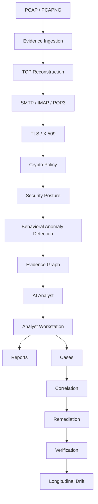

# SecureMailScope User Guide

A complete end-user and analyst manual for SecureMailScope (NS-Email):
install it, start it, analyze a PCAP, inspect the evidence, investigate a
case, use the AI assistant, generate reports, correlate captures, manage
remediation, track longitudinal drift, run the demo and evaluations, and
troubleshoot problems.

Every command, endpoint, environment variable, and behavior in this guide
was taken from the actual repository. Companion documents:

- Setup reference: [docs/development/SETUP.md](development/SETUP.md)
- Architecture: [docs/architecture/README.md](architecture/README.md)
- Evaluation report: [docs/evaluation/README.md](evaluation/README.md)
- Design decisions: [docs/decisions/](decisions/001-capture-evidence-ingestion.md)

---

## 1. What is SecureMailScope?

SecureMailScope is a **passive network forensic platform** that
reconstructs email traffic from captured packets and assesses how well
that traffic was actually protected.

You give it a PCAP or PCAPNG file containing email traffic. It
reconstructs the TCP streams, identifies the email sessions, parses the
TLS handshakes, extracts the X.509 certificates, checks everything
against a cryptographic policy, scores the posture, flags behavioral
outliers, and presents the whole picture — with every conclusion tied
to the packets it came from.

What it covers, end to end:

- **Email protocols** — SMTP, IMAP, and POP3 session reconstruction,
  including STARTTLS negotiation.
- **TLS/X.509 analysis** — negotiated versions, cipher suites, key
  exchange, SNI/ALPN/extensions, certificate chains, validity,
  signatures, and keys.
- **Cryptographic posture assessment** — 15 deterministic policy rules
  plus an explainable 0–100 posture score per capture.
- **Behavioral anomaly detection** — an unsupervised model trained on
  each capture's own sessions (local only, no external services).
- **Evidence graph** — sessions, certificates, TLS configurations,
  findings, and anomalies as a navigable graph.
- **AI-assisted investigation** — an evidence-grounded assistant that
  explains findings with citations (never a source of truth).
- **Case management** — multi-capture investigations with notes, tags,
  bookmarks, timelines, reports, and bundles.
- **Multi-capture correlation** — deterministic shared-evidence
  relationships across a case's captures.
- **Remediation and verification** — analyst plans over immutable
  findings, verified against later captures.
- **Longitudinal drift analysis** — how posture, findings, and
  configurations changed across observations, including regression
  detection.
- **Reporting** — deterministic JSON, HTML, and PDF forensic reports
  for captures and cases.

Be clear about what it is **not**:

- It analyzes **captured network evidence**. It is not an active email
  scanner.
- It does **not** log into mail servers.
- It does **not** attack systems or send test emails.
- It does **not** monitor live traffic; it reads PCAP/PCAPNG files you
  provide.
- Compliance scanners test endpoints on demand. SecureMailScope answers
  a different question: **what actually happened to real email traffic
  on the wire**.

---

## 2. System Architecture

The pipeline flows from raw capture to analyst decision:



What each layer does:

| Layer | What it does |
| --- | --- |
| Evidence Ingestion | Validates the upload (extension, magic bytes, structure), streams a SHA-256 hash, stores bytes under a content-derived id, registers the capture |
| TCP Reconstruction | Groups packets into bidirectional flows, reassembles streams (tracking out-of-order delivery, retransmissions, and gaps honestly) |
| SMTP / IMAP / POP3 | Detects the protocol with explainable evidence and confidence, reconstructs sessions with per-event timelines citing packet numbers, detects STARTTLS negotiation |
| TLS / X.509 | Parses handshake records: negotiated version, offered/selected ciphers, key exchange, SNI and extensions, visible certificate chain |
| Crypto Policy | 15 deterministic rules produce evidence-backed findings with severity, confidence, and remediation guidance |
| Security Posture | Transparent 0–100 score per capture with five factors, per-protocol/per-host aggregation, and a priority ranking |
| Behavioral Anomaly Detection | IsolationForest over typed session features, trained per capture; statistical outliers only |
| Evidence Graph | Typed nodes and edges (sessions, certificates, TLS configurations, findings, anomalies) with certificate and configuration pivots |
| AI Analyst | Evidence-grounded answers with observed/interpretation/uncertainty sections and citations |
| Analyst Workstation | Next.js UI: dashboard, captures, sessions, findings, anomalies, graph, reports |
| Reports | Deterministic JSON/HTML/PDF generated on demand from persisted evidence |
| Cases | Multi-capture investigations: references, notes, tags, bookmarks, timeline, reports, export/bundle |
| Correlation | Deterministic shared-evidence relationships across a case's captures |
| Remediation | Analyst plans with an explicit state machine, ownership, and timeline |
| Verification | Evidence-based comparison of a rule against a later capture, plus manual analyst assertion |
| Longitudinal Drift | Observation snapshots, explicit baselines, pairwise comparison, posture trends, finding lifecycles, regression detection |

The system is a deliberate small monorepo: one FastAPI backend, one
analysis engine, one Next.js frontend, one SQLite store. No
microservices, no message queues, no distributed workers. The engine is
a pure in-process Python library — it never talks HTTP. See
[docs/architecture/README.md](architecture/README.md) for boundaries
and [docs/decisions/](decisions/001-capture-evidence-ingestion.md) for
the decision records behind each stage.

---

## 3. Requirements

| Tool | Version | Category | Notes |
| --- | --- | --- | --- |
| Python | 3.12+ | REQUIRED | Backend and engine |
| Node.js | 20+ (npm 10+) | REQUIRED | Frontend |
| Git | any recent | REQUIRED | Cloning, version control |
| SQLite | bundled with Python | REQUIRED | Evidence store (no separate database to install) |
| tshark (Wireshark 4.x) | any recent 4.x | OPTIONAL | Packet metadata extraction; everything else works without it |
| Docker + Docker Compose | recent | OPTIONAL | Containerized deployment only |
| An LLM endpoint | OpenAI-compatible or Ollama | OPTIONAL | AI assistant only; the `mock` provider needs nothing |
| OS | Linux, macOS, Windows (WSL/Git Bash supported) | REQUIRED (one of) | `make` targets are POSIX-only; Windows users run the plain commands |

Storage: capture evidence, the registry, and staging live under
`data/captures` by default (override with `NS_EMAIL_CAPTURE_STORAGE`).
Plan for at least a few hundred megabytes for evaluation and demo use;
production sizing follows your PCAP volumes.

---

## 4. Clone the Project

```bash
git clone https://github.com/ToTheBlankWorld/NS-Email.git
cd NS-Email
```

This guide assumes all commands run from that repository root unless a
different directory is stated.

---

## 5. Installation

### Backend setup

```bash
# 1. Create and activate a virtual environment
python -m venv .venv
source .venv/bin/activate            # POSIX (Git Bash / WSL / macOS / Linux)
# .venv\Scripts\Activate.ps1         # Windows PowerShell
# .venv\Scripts\activate.bat         # Windows cmd

# 2. Install the backend + engine with development tools
python -m pip install --upgrade pip
python -m pip install -e ".[dev]"
```

The editable install exposes the `app` (backend) and `engine` packages.
No database migrations exist: the SQLite registry, session store, case
store, remediation store, and drift baseline table are created
automatically inside the storage directory on first startup. No storage
initialization step is needed.

POSIX shortcut: `make setup-backend` (equivalent to the two steps
above) and `make setup-frontend` (equivalent to `npm install` below).

### Frontend setup

```bash
cd frontend
npm install
```

### Environment configuration

Copy the template and adjust as needed:

```bash
cp .env.example .env
```

The backend reads plain environment variables (no automatic `.env`
loading), so export the ones you override in your shell. Never commit a
real `.env` — it is git-ignored.

---

## 6. Environment Configuration

Backend variables (see `backend/app/config.py` and `.env.example`):

| Name | Purpose | Required / Optional | Default | Example | Security note |
| --- | --- | --- | --- | --- | --- |
| `NS_EMAIL_CORS_ORIGINS` | Comma-separated browser CORS allow-list | Optional | `http://localhost:3000` | `https://soc.example.org` | Restrict to your frontend origin in shared deployments |
| `NS_EMAIL_CAPTURE_STORAGE` | Evidence, registry, and staging root | Optional | `data/captures` | `/srv/ns-email/captures` | Must be a trusted local path; never expose it over HTTP |
| `NS_EMAIL_MAX_CAPTURE_BYTES` | Upload size limit | Optional | `2147483648` (2 GiB) | `536870912` | Capped by the engine ceiling regardless of configuration |
| `NS_EMAIL_TSHARK_PATH` | Explicit tshark binary path | Optional | empty (uses `PATH` lookup) | `/usr/bin/tshark` | Fixed executable path only; never derived from uploads |
| `NS_EMAIL_POLICY_FILE` | Custom policy JSON document | Optional | empty (built-in `securemailscope-baseline` v1.0) | `/etc/ns-email/policy.json` | Parsed as structured data only; never executed |
| `NS_EMAIL_MAX_GRAPH_NODES` | Evidence-graph node cap | Optional | `50000` | `20000` | Exceeding it omits the graph with an explicit warning |
| `NS_EMAIL_AI_PROVIDER` | AI backend | Optional | empty (disabled) | `mock`, `openai`, or `ollama` | Empty is valid and leaves the analyst disabled |
| `NS_EMAIL_AI_MODEL` | Model identifier | Required for `openai` | empty | `gpt-4o-mini` | Sent only to the configured provider |
| `NS_EMAIL_AI_BASE_URL` | Provider base URL | Required for `openai`/`ollama` | empty | `http://localhost:11434` | Must start with `http://` or `https://` |
| `NS_EMAIL_AI_API_KEY` | Provider API key | Optional (required by most hosted providers) | empty | `<YOUR_API_KEY>` | Never sent to the frontend; never logged; never commit it |

Invalid AI configuration fails fast at startup with an actionable,
secret-free message instead of misbehaving later.

Frontend variable:

| Name | Purpose | Required / Optional | Default |
| --- | --- | --- | --- |
| `NEXT_PUBLIC_API_BASE_URL` | Backend URL the browser client calls | Optional | `http://localhost:8000` |

### AI configuration explained

- `NS_EMAIL_AI_PROVIDER=mock` — deterministic offline provider for
  testing, evaluation, CI, and the demo. Needs no network and no key.
- `NS_EMAIL_AI_PROVIDER=ollama` with `NS_EMAIL_AI_BASE_URL` (for
  example `http://localhost:11434`) — local models, nothing leaves
  your machine except to your own Ollama server.
- `NS_EMAIL_AI_PROVIDER=openai` with `NS_EMAIL_AI_BASE_URL`,
  `NS_EMAIL_AI_MODEL`, and `NS_EMAIL_AI_API_KEY` — hosted
  OpenAI-compatible endpoints.
- **When AI is not configured** (empty provider), the AI status
  reports `not_configured` and queries return a structured error.
  Everything else — ingestion, analysis, findings, posture,
  anomalies, graph, cases, correlation, remediation, drift, reports —
  works exactly the same.

---

## 7. Starting the Application

### Development backend

From the repository root, with the virtual environment active:

```bash
uvicorn app.main:app --reload --port 8000
```

POSIX shortcut: `make backend`.

- API base: `http://127.0.0.1:8000`
- Health: `http://127.0.0.1:8000/health`
- Readiness: `http://127.0.0.1:8000/ready`
- Interactive API docs: `http://127.0.0.1:8000/docs`

### Development frontend

```bash
cd frontend
npm run dev
```

POSIX shortcut (from root): `make frontend`.

Open **http://localhost:3000**. The UI detects the backend via
`NEXT_PUBLIC_API_BASE_URL` and shows a live backend status indicator.

### Production frontend build

```bash
cd frontend
npm run build
npm run start
```

### Docker

```bash
docker compose up --build
```

Backend on `:8000`, frontend on `:3000` (see `docker-compose.yml`).
The default compose file runs the backend with the `mock` AI provider
and a `capture-data` volume — no secrets required. Provide AI
credentials via an `.env` file only if an external provider is wanted.
Shut down with `docker compose down`. The backend healthcheck probes
`http://127.0.0.1:8000/ready` inside the container.

---

## 8. First-Time Quick Start

A five-minute first run (backend on :8000, frontend on :3000):

1. Start the backend: `uvicorn app.main:app --reload --port 8000`.
2. Start the frontend: `cd frontend && npm run dev`.
3. Open http://localhost:3000 and confirm the backend status shows
   reachable.
4. Upload a PCAP: Captures page → upload (`POST /api/captures`).
5. Analyze the capture (`POST /api/captures/<capture_id>/analyze`).
6. Open the dashboard for session counts and posture state.
7. Inspect findings (`/findings`) — open one to read its evidence,
   severity, confidence, and remediation guidance.
8. Open a session (`/sessions/<session_id>`) — protocol, endpoints,
   STARTTLS facts, per-event timeline.
9. Inspect TLS and certificates on the session — version, cipher, key
   exchange, chain, validity, fingerprints.
10. Open the evidence graph (`/graph`) and pivot from a certificate or
    TLS configuration to the sessions that used it.
11. Ask the AI about a session (requires a configured provider;
    otherwise the UI reports AI is not configured).
12. Generate a report: capture page or Report Center (`/reports`) →
    JSON, HTML, or PDF.

No account, no license key, and no network access are needed for any
of this except an optionally configured external AI provider.

---

## 9. PCAP Ingestion

Supported formats: **PCAP and PCAPNG** (classic libpcap and the
next-generation container).

Upload process:

```bash
curl -F "file=@sample.pcap" http://127.0.0.1:8000/api/captures
curl http://127.0.0.1:8000/api/captures
curl http://127.0.0.1:8000/api/captures/<capture_id>
```

What happens to your upload:

1. The display filename is validated (extension allow-list; path
   components rejected) — the filename never addresses the
   filesystem.
2. The stream is hashed (SHA-256), size-limited, and magic-byte
   sniffed in a single pass inside a staging directory.
3. The capture receives a deterministic content-derived id:
   `capture_<first-12-hex-of-sha256>`. Re-uploading identical bytes
   returns the existing registration with `duplicate: true`.
4. Bytes move atomically to
   `NS_EMAIL_CAPTURE_STORAGE/<capture_id>/evidence.<format>`.
5. A structural inspection runs (tshark when available, otherwise the
   pure-Python reader), and the capture is registered in SQLite.

Analysis lifecycle per capture: `registered` (hashed and stored;
packet metadata unavailable without tshark) → analyzed via
`POST /api/captures/<capture_id>/analyze` → `completed` (or
`failed` with a controlled error state — evidence is never silently
truncated).

Security protections on this path:

- Filenames and payloads are untrusted input: validated,
  size-limited, processed in temporary directories with explicit
  filesystem boundaries.
- Magic-byte validation rejects non-capture uploads; truncation and
  garbage are handled as structured errors, not crashes.
- No `eval`/`exec` on packet-derived data, ever; no shell commands
  derived from user input (tshark launches with fixed argument
  arrays).
- Malformed ids, traversal-shaped strings, and oversized inputs are
  rejected with structured errors that never leak SQL, paths, or
  tracebacks.

---

## 10. Capture Analysis

Analyze, then explore:

```bash
curl -X POST http://127.0.0.1:8000/api/captures/<capture_id>/analyze
curl http://127.0.0.1:8000/api/captures/<capture_id>/sessions
curl http://127.0.0.1:8000/api/sessions/<session_id>
```

Each session records client/server IPs and ports, the detected
protocol (**SMTP, IMAP, or POP3**) with explainable evidence and
confidence, and a per-event timeline where every event cites the
packets it was observed in. TCP reconstruction tracks out-of-order
segments, retransmissions, gaps, and termination honestly instead of
papering over them.

STARTTLS is detected as advertised / requested / accepted with the
exact transition packet, so downgrade-shaped behavior (offered but
never enforced, stripped, negotiated down) is visible in the session
record.

Privacy by design: **credential values are redacted before storage**,
and **email message bodies, credentials, and raw packet payloads are
excluded from all API output, reports, exports, and AI context**.
Session records describe the security envelope (who talked to whom,
how it was protected), never the content.

---

## 11. TLS and Certificate Analysis

Where a session switches to TLS (STARTTLS boundary or implicit-TLS
port), the engine parses the handshake and records:

- Negotiated TLS version and the offered cipher-suite list
- Selected cipher suite and key-exchange family (with forward-secrecy
  classification)
- ClientHello / ServerHello parameters, SNI, ALPN, and other hello
  extensions
- The visible X.509 chain: subject, issuer, serial, validity window,
  signature algorithm, public-key characteristics, and SHA-256
  fingerprints, with chain position
- Handshake completeness (incomplete handshakes are findings, not
  silent gaps)

Honest limitation: **TLS 1.3 encrypts certificates from the
ServerHello onward**. When the capture cannot show the certificates,
the evidence records that explicitly instead of pretending otherwise.
Similarly, encrypted application payloads are never decrypted — the
analysis covers what the wire reveals: negotiation, parameters, and
visible authentication material.

---

## 12. Security Findings

The deterministic policy engine (built-in baseline
`securemailscope-baseline` v1.0, shipped in `engine/detection/data/`)
evaluates the structured evidence with 15 rules:

| Rule | Meaning |
| --- | --- |
| `TLS-VERSION-001` | Deprecated TLS version negotiated (SSLv3, TLS 1.0/1.1) |
| `CIPHER-SELECTED-001` | Weak or otherwise unacceptable cipher-suite class selected |
| `CIPHER-UNKNOWN-001` | Unrecognized cipher suite observed |
| `KEYEX-001` | Prohibited key-exchange family |
| `FS-001` | Missing forward secrecy |
| `CERT-VALIDITY-001` | Certificate invalid at capture time (expired / not-yet-valid) |
| `CERT-KEY-001` | Weak public key |
| `CERT-SIG-001` | Weak signature algorithm (MD5 / SHA-1) |
| `CERT-IDENTITY-001` | Hostname / SAN mismatch |
| `CERT-CHAIN-001` | Chain observation (incomplete or otherwise notable chain) |
| `CERT-SELF-SIGNED-001` | Self-signed certificate |
| `STARTTLS-001` | STARTTLS gap (offered but not enforced, stripped, or downgraded) |
| `AUTH-PLAINTEXT-001` | Plaintext authentication |
| `TLS-FAILURE-001` | Incomplete handshake |
| `PLAINTEXT-001` | Unprotected plaintext email session |

```bash
curl http://127.0.0.1:8000/api/captures/<capture_id>/findings
curl http://127.0.0.1:8000/api/sessions/<session_id>/findings
curl http://127.0.0.1:8000/api/findings/<finding_id>
```

Each finding carries a deterministic id, structured evidence
references with packet numbers, **severity** (how bad) kept separate
from **confidence** (how sure), remediation guidance, and standard
references (for example RFC 8996, RFC 7525).

To investigate a finding: open it (`/findings/<finding_id>`), read
the evidence references, pivot to the cited session and packets, check
the certificate and TLS details, then decide. Findings are
**historical observations** — later remediation never edits them.
They stay exactly as observed; verification and drift describe what
*later* captures showed.

---

## 13. Security Posture

Every analysis produces an explainable posture snapshot. **The posture
score is a SecureMailScope-defined analytical metric** — not an
industry certification, not a CVSS score, not an ML output.

The documented formula (see
[ADR 005](decisions/005-security-posture-model.md)):

```
finding deduction = severity_weight x confidence_multiplier x prevalence_multiplier
  severity weights:      critical 40, high 25, medium 12, low 5, info 0
  confidence multiplier: high 1.0, medium 0.75, low 0.5, unknown 0.25
  prevalence multiplier: 0.5 + 0.5 x (affected_sessions / total_sessions)

factor deduction = max finding deduction in the factor
                   + 0.25 x (sum of remaining deductions in the factor)

overall score = round(100 - sum of factor deductions), clamped to 0-100
```

Findings map to five factors (TLS configuration, certificates,
STARTTLS usage, authentication, handshake reliability). The score,
state, overall confidence, per-factor breakdown, per-protocol and
per-host aggregation, and a deterministic priority ranking all cite
the findings they derive from. The UI explains the calculation under
"How is this calculated?".

| Score | State |
| --- | --- |
| ≥ 90 | `healthy` |
| 75–89 | `acceptable` |
| 60–74 | `degraded` |
| 40–59 | `high_exposure` |
| < 40 | `critical_exposure` |
| no sessions | `insufficient_evidence` (score null — never fabricated) |

```bash
curl http://127.0.0.1:8000/api/captures/<capture_id>/posture
curl http://127.0.0.1:8000/api/captures/<capture_id>/posture/protocols
curl http://127.0.0.1:8000/api/captures/<capture_id>/priorities
curl http://127.0.0.1:8000/api/captures/<capture_id>/hosts
curl http://127.0.0.1:8000/api/captures/<capture_id>/hosts/<host_id>
```

---

## 14. Anomalies

After deterministic analysis, an **IsolationForest** model trained on
the capture's own sessions flags behavioral outliers. Feature vectors
are versioned, sanitized, and derived only from structured evidence —
never from raw payloads. All processing is local.

```bash
curl http://127.0.0.1:8000/api/captures/<capture_id>/anomalies
curl http://127.0.0.1:8000/api/sessions/<session_id>/anomaly
curl http://127.0.0.1:8000/api/captures/<capture_id>/anomaly-summary
```

Results use bands (`normal`, `unusual`, …). Sessions below the minimum
baseline size report `insufficient_evidence`; model failures report
`model_error`. Anomaly output is kept strictly separate from findings
and never feeds the posture score.

Two sentences to internalize:

- **An anomaly does not mean an attack.** It means "unusual relative
  to this capture's own baseline".
- **An anomaly score is not a compromise probability.** Bands describe
  statistical deviation, never maliciousness.

---

## 15. Evidence Graph

The forensic graph links sessions, certificates, TLS configurations,
findings, and anomalies as typed nodes and edges, with certificate
and TLS-configuration pivots ("which sessions used this
certificate?"). It is served per capture and rendered interactively
in the frontend with React Flow (deterministic layered layout, type
filters, inspection panel).

```bash
curl http://127.0.0.1:8000/api/captures/<capture_id>/graph
```

Navigate from a session to its certificates, from a certificate to
every session that presented it, from a finding to its evidence —
then bookmark nodes into a case without moving any evidence. If a
capture exceeds `NS_EMAIL_MAX_GRAPH_NODES` (default 50,000), the
analysis stays intact, the graph is omitted, and an explicit warning
is surfaced.

---

## 16. AI Forensic Analyst

The AI assistant consumes **structured investigation context, never
raw evidence**, and returns responses with observed facts,
interpretation, uncertainty, and evidence citations.

```bash
# Check AI status
curl http://127.0.0.1:8000/api/ai/status

# Ask about a session
curl -X POST http://127.0.0.1:8000/api/ai/query \
  -H "Content-Type: application/json" \
  -d '{"question": "Explain this session", "session_id": "session_..."}'

# Query history for a capture (validated observations only)
curl http://127.0.0.1:8000/api/ai/history/<capture_id>
```

Provider architecture: `mock` (deterministic, offline — used by the
demo, evaluations, and CI), `openai` (OpenAI-compatible endpoints),
or `ollama` (local models). Configure with `NS_EMAIL_AI_PROVIDER`,
`NS_EMAIL_AI_MODEL`, `NS_EMAIL_AI_BASE_URL`, `NS_EMAIL_AI_API_KEY`.

Hard boundaries — the AI:

- does **not** create findings
- does **not** modify findings, posture, or anomaly scores
- does **not** mark remediations verified or change drift records
- does **not** declare compromise or infer attacker behavior
- does **not** replace deterministic analysis — findings remain
  authoritative, AI output is assistive interpretation

**AI not configured:** status reports `not_configured`, queries return
a structured error, and reports render an explicit "AI analyst not
configured" notice. Nothing else changes.

Security around AI context: the context builder minimizes and
sanitizes input (fixed context budget, question length cap),
redacts credentials, excludes message bodies and raw payloads,
validates citations against supplied evidence, defends against prompt
injection, and **never forwards analyst case notes to the provider**.
Only validated observations are quoted in reports.

---

## 17. Analyst Workstation

The Next.js frontend is a dense, dark-first SOC-style workspace.

| Route | Purpose |
| --- | --- |
| `/` | Dashboard: captures, backend status, analysis entry points |
| `/captures` | Registered captures, upload, analysis |
| `/captures/[id]` | Capture detail: sessions, findings, posture, reports |
| `/captures/[id]/findings/[findingId]` | Finding detail within a capture |
| `/sessions` | Sessions across captures |
| `/sessions/[id]` | Session investigation: timeline, TLS, certificates, AI panel |
| `/findings` | Findings workspace with filtering and deep links |
| `/findings/[id]` | Finding detail with remediation actions |
| `/anomalies` | Anomaly workspace |
| `/anomalies/[id]` | Anomaly detail |
| `/graph` | Interactive evidence graph |
| `/reports` | Report Center: capture and case reports |
| `/cases` | Case list, creation, bundle import |
| `/cases/[caseId]` | Case workspace (see below) |

Case workspace tabs: **overview, evidence, findings, anomalies,
graph, correlations, remediations, drift, notes, bookmarks,
timeline, reports**. The workspace links to existing evidence views
rather than duplicating them; empty states guide each step and no
statistic is ever fabricated.

---

## 18. Reporting

Capture reports (per capture) and case reports (per investigation)
come in three formats:

| Format | Purpose | How to generate |
| --- | --- | --- |
| JSON | Machine-readable evidence, diffing, automation | `GET …/report.json` or Report Center |
| HTML | Standalone printable document, no external assets or JavaScript | `GET …/report.html` or Report Center |
| PDF | Structured print-ready document (fpdf2) | `GET …/report.pdf` or Report Center |

```bash
# Capture reports
curl -OJ http://127.0.0.1:8000/api/captures/<capture_id>/report.json
curl -OJ http://127.0.0.1:8000/api/captures/<capture_id>/report.html
curl -OJ http://127.0.0.1:8000/api/captures/<capture_id>/report.pdf

# Case reports
curl -OJ http://127.0.0.1:8000/api/cases/<case_id>/report.json
curl -OJ http://127.0.0.1:8000/api/cases/<case_id>/report.html
curl -OJ http://127.0.0.1:8000/api/cases/<case_id>/report.pdf
```

Reports are generated on demand from persisted evidence —
deterministic per evidence state, never stored as blobs. Every
dynamic value is escaped (HTML) or sanitized (PDF). Content classes
stay explicitly separated: **forensic evidence**, **analyst work**,
**AI interpretation** (validated observations only, clearly labeled,
with citations and uncertainty preserved). Case reports quote
per-capture posture verbatim and compute no case-level score.

Limitations: PDF text is Latin-1 sanitized (exotic evidence strings
are transliterated), and provenance sections are labeled "Technical
provenance metadata" — not legal chain-of-custody claims.

---

## 19. Case Management

Cases organize one or more captures into an investigation and preserve
analyst context. The workspace UI lives at `/cases` and
`/cases/<case_id>`.

```bash
# Create a case
curl -X POST http://127.0.0.1:8000/api/cases \
  -H "Content-Type: application/json" \
  -d '{"title": "Mixed TLS investigation", "priority": "HIGH"}'

# Attach a capture (reference only — no data is copied)
curl -X POST http://127.0.0.1:8000/api/cases/<case_id>/captures \
  -H "Content-Type: application/json" \
  -d '{"capture_id": "<capture_id>"}'

# Analyst workflow metadata (never alters forensic evidence)
curl http://127.0.0.1:8000/api/cases/<case_id>/summary
curl -X POST http://127.0.0.1:8000/api/cases/<case_id>/notes \
  -H "Content-Type: application/json" \
  -d '{"target_type": "finding", "target_id": "<finding_id>", "content": "Follow up."}'
curl -X POST http://127.0.0.1:8000/api/cases/<case_id>/tags \
  -H "Content-Type: application/json" -d '{"tag": "tls"}'
curl -X POST http://127.0.0.1:8000/api/cases/<case_id>/bookmarks \
  -H "Content-Type: application/json" \
  -d '{"target_type": "finding", "target_id": "<finding_id>", "label": "root cause?"}'
curl http://127.0.0.1:8000/api/cases/<case_id>/timeline
```

Case building blocks:

- **Status**: `OPEN`, `IN_REVIEW`, `CLOSED`, `ARCHIVED`.
  **Priority**: `LOW`, `MEDIUM`, `HIGH`, `CRITICAL`.
- **Notes**: analyst-authored, length-capped, escaped in reports,
  never evidence, never sent to AI.
- **Tags**: lowercase analyst labels for triage.
- **Bookmarks**: named references (finding, anomaly, session,
  certificate, TLS handshake, graph node, timeline event) — the
  evidence stays where it was recorded.
- **Case timeline**: append-only log of what the analyst *did*.
- **Case reports / export / bundle**: Section 18 and Section 24.

Two timelines, never confused:

- **Forensic timeline** — reconstructed from captured packets inside
  sessions (what happened on the wire).
- **Case timeline** — investigation events performed during the case
  (what the analyst did). This is not packet truth.

---

## 20. Multi-Capture Correlation

Correlation derives **repeated structured observations** across a
case's captures — fully offline, deterministic, read-only. The ten
correlation types:

`shared_endpoint`, `shared_host`, `shared_certificate`,
`shared_certificate_subject`, `shared_tls_configuration`,
`shared_protocol`, `shared_finding`, `shared_anomaly_pattern`,
`repeated_session_pattern`, `shared_evidence`

Each correlation carries a strength (`direct` or `derived`), a
deterministic `corr_` id bound to the case, occurrence counts, and
the source captures/sessions. Inspect them in the workspace
Correlations tab (filters, search, detail, session
related-observations, layered investigation graph) or via API:

```bash
curl "http://127.0.0.1:8000/api/cases/<case_id>/correlations?sort=type"
curl http://127.0.0.1:8000/api/cases/<case_id>/correlations/summary
curl http://127.0.0.1:8000/api/cases/<case_id>/correlations/<correlation_id>
curl http://127.0.0.1:8000/api/cases/<case_id>/correlations/<correlation_id>/context
curl http://127.0.0.1:8000/api/cases/<case_id>/sessions/<session_id>/related
curl http://127.0.0.1:8000/api/cases/<case_id>/graph
```

Read this carefully — correlation means **shared evidence, nothing
more**. It does NOT mean attacker attribution, maliciousness, common
ownership, or compromise, and no correlation score exists. The
reports and evaluation harnesses state this explicitly.

---

## 21. Remediation

Remediation plans track analyst action against immutable findings
(workspace Remediations tab, or the finding detail Remediation
section):

```bash
# Create a remediation from a finding (policy guidance preserved verbatim)
curl -X POST http://127.0.0.1:8000/api/cases/<case_id>/remediations/from-finding \
  -H "Content-Type: application/json" \
  -d '{"finding_id": "<finding_id>", "owner": "netops"}'

# Move through the explicit state machine
curl -X PATCH http://127.0.0.1:8000/api/cases/<case_id>/remediations/<remediation_id> \
  -H "Content-Type: application/json" -d '{"status": "IN_PROGRESS"}'

curl http://127.0.0.1:8000/api/cases/<case_id>/remediations/<remediation_id>/verification
curl http://127.0.0.1:8000/api/cases/<case_id>/remediations/<remediation_id>/timeline
```

- **Statuses**: `OPEN → PLANNED → IN_PROGRESS → COMPLETED`,
  `IN_PROGRESS ↔ BLOCKED`, anything → `CANCELLED`
  (`COMPLETED`/`CANCELLED` are terminal with history retained).
- **Ownership**: free-form workflow text (team or analyst name).
- **Timeline**: per-remediation, insertion-ordered, append-only.
- Records created from a finding preserve the policy recommendation
  verbatim, flagged as policy-sourced vs analyst-written.

The iron rule: **remediation never mutates the historical finding it
targets**. Findings stay exactly as observed; the workflow describes
what analysts planned and did.

---

## 22. Verification

Verification compares an original rule against an explicitly selected,
attached, analyzed **verification capture**:

```bash
# Evidence-based verification
curl -X POST http://127.0.0.1:8000/api/cases/<case_id>/remediations/<remediation_id>/verify \
  -H "Content-Type: application/json" \
  -d '{"mode": "evidence", "verification_capture_id": "<capture_id>"}'

# Manual verification (analyst note required to complete)
curl -X POST http://127.0.0.1:8000/api/cases/<case_id>/remediations/<remediation_id>/verify \
  -H "Content-Type: application/json" \
  -d '{"mode": "manual", "notes": "Confirmed during maintenance window."}'
```

Outcomes: **VERIFIED** (rule absent for the relevant session),
**FAILED** (rule still present), **INCONCLUSIVE** (relevant session
or evidence missing — the honest answer, never a false VERIFIED).
Session-scoped findings match by protocol plus server endpoint, so
unrelated sessions neither clear nor condemn. Every result carries a
neutral statement ("Rule X was not observed in verification capture
C") and quotes posture before/after with no causal claim; manual
results are labeled `analyst_asserted`.

Why absence is not proof: **a missing finding in one capture does not
prove global security**. It proves only that the rule was not observed
in the relevant evidence of that capture. Verification evidence
describes one later observation — nothing more.

---

## 23. Longitudinal Drift

While verification answers "did this rule clear in *that* capture?",
longitudinal drift answers "how did the security posture change
*across observations*?" — derived intelligence over immutable
history, never a rewrite of it.

Building blocks:

- **Observations** — deterministic snapshots of each attached capture
  (posture, finding rules, TLS/certificate/protocol/anomaly
  summaries), recomputed on demand, never persisted as separate truth.
- **Baseline** — the analyst explicitly selects one attached capture
  as the comparison anchor. Nothing is selected automatically.
- **Posture trend** — quoted Stage 5 scores and states in attachment
  order with arithmetic deltas ("Posture score changed from 74 to
  88."). No new formula, no drift score, no causal claims.
- **Finding lifecycle** per rule: `NEW` (in later, absent from
  baseline), `PERSISTENT` (in both), `RESOLVED` (in baseline, absent
  later with comparable evidence), `RECURRED` (present, then
  comparably absent, then present again), `NOT_COMPARABLE`
  (insufficient comparable evidence — an unrelated capture never
  proves resolution).
- **Configuration drift** — TLS version/cipher/key-exchange changes
  (reusing evidence-graph fingerprints), certificate
  fingerprint/validity/signature changes, protocol behavior changes,
  anomaly-band changes, correlation pattern changes.
- **Remediation regression** — a `RECURRED` condition linked to a
  remediation with a prior VERIFIED verification surfaces
  "Existing remediation … may require review." Workflow state is
  never auto-closed or reopened; the analyst acts explicitly.

```bash
curl http://127.0.0.1:8000/api/cases/<case_id>/observations
curl -X POST http://127.0.0.1:8000/api/cases/<case_id>/observations/baseline \
  -H "Content-Type: application/json" -d '{"capture_id": "<capture_id>"}'
curl http://127.0.0.1:8000/api/cases/<case_id>/observations/baseline
curl http://127.0.0.1:8000/api/cases/<case_id>/comparisons
curl -X POST http://127.0.0.1:8000/api/cases/<case_id>/comparisons \
  -H "Content-Type: application/json" \
  -d '{"baseline_capture_id": "<capture_a>", "comparison_capture_id": "<capture_c>"}'
curl "http://127.0.0.1:8000/api/cases/<case_id>/drift?type=finding_recurred"
curl http://127.0.0.1:8000/api/cases/<case_id>/drift/summary
curl http://127.0.0.1:8000/api/cases/<case_id>/drift/<drift_id>
curl http://127.0.0.1:8000/api/cases/<case_id>/remediations/<remediation_id>/drift
```

The workspace Drift tab shows posture trend, finding lifecycle,
configuration changes, regressions, observations, and drift detail
(before/after, evidence references, related finding/remediation/
verification/correlation) in neutral language: "Certificate
fingerprint changed between capture A and capture B" — never "the
attacker replaced the certificate."

Drift vocabulary (all ten types): `posture_change`,
`finding_introduced`, `finding_resolved`, `finding_recurred`,
`tls_configuration_changed`, `certificate_changed`,
`certificate_validity_changed`, `protocol_behavior_changed`,
`anomaly_state_changed`, `correlation_pattern_changed`. Records carry
stable `drift_` ids and fire only when the underlying evidence
supports them.

---

## 24. Case Export / Bundle

```bash
curl -OJ http://127.0.0.1:8000/api/cases/<case_id>/export
curl -OJ http://127.0.0.1:8000/api/cases/<case_id>/bundle
# Bundle WITH raw evidence bytes (explicit opt-in only):
curl -OJ "http://127.0.0.1:8000/api/cases/<case_id>/bundle?include_evidence=true"
```

- **JSON export** (schema `1.3`): case, captures, findings, anomalies,
  bookmarks, notes, tags, timeline, reports, correlations,
  remediations, verification results, observations, baseline,
  comparisons, drift, drift summary, provenance.
- **Bundle** (reproducible zip, fixed archive timestamps): `case.json`,
  `README.txt`, `evidence-manifest.json`,
  `reports/case-report.json`, plus `evidence/` only on explicit
  request.
- **Import** (`POST /api/cases/import`) always creates a *new* case
  and accepts schema `1.0`–`1.3`. Captures attach only when matching
  evidence is registered locally (SHA-256). Imported correlations and
  drift are validated for shape and **recomputed from local
  evidence, never trusted**; verification state resets; only the
  baseline choice transfers when its capture attached locally.

Security restrictions: exports and bundles exclude raw email bodies,
credentials, raw packet payloads, unvalidated AI output, SQL, and
filesystem internals. Oversized bundles and malformed sections are
rejected with structured errors.

---

## 25. Demo Mode

The deterministic offline demo seeds synthetic fixtures, runs the full
workflow over the real API with the mock AI provider, and verifies
every step:

```bash
python -m scripts.demo                 # seed, verify, then serve
python -m scripts.demo --run-once      # seed + verify + exit (CI-safe)
python -m scripts.demo --port 8080     # custom port (default 8900)
python -m scripts.demo --storage-dir /tmp/nsdemo   # custom storage (default .demo/)
```

What it creates: 15 synthetic scenarios (secure, deprecated, weak,
expired, mismatched, plaintext, handshake, anomaly, mixed) with
captures analyzed, AI queried, and reports generated; a case with
attached captures, bookmarks, notes, tags, correlations, and a
verified remediation; and a longitudinal drift case (baseline →
verification → regression) showing the posture trend, resolved and
recurring findings, configuration drift, and remediation regression —
ending with case reports and bundles.

- Requires **no internet**, no external LLM, no real credentials.
- Never touches production storage (isolated directory unless
  `--storage-dir` is given).
- Reset/clean: delete the storage directory (default `.demo/`) and
  re-run; seeding is deterministic, so identical state yields
  identical ids.

---

## 26. Evaluation

Deterministic harnesses drive synthetic fixtures with hand-defined
ground truth through the real API and exit non-zero on any mismatch:

```bash
python -m scripts.evaluate --repeat 2               # Stage 10: 15-scenario ground truth
python -m scripts.evaluate_cases --repeat 2         # Stage 11: case workflow
python -m scripts.evaluate_correlations --repeat 2  # Stage 12: correlation
python -m scripts.evaluate_remediation --repeat 2   # Stage 13: remediation
python -m scripts.evaluate_drift --repeat 2         # Stage 14: longitudinal drift
```

Each supports `--repeat N` (multi-run determinism) and `--json <path>`
(machine-readable output). Full results are documented in
[docs/evaluation/README.md](evaluation/README.md).

What "deterministic" means here: identical fixtures plus identical
code produce identical findings, posture, drift types, evidence keys,
relationships, and ordering. Random ids (case ids) and wall-clock
timestamps are explicitly dynamic metadata and compared structurally,
not literally.

Clearly stated limitation: **synthetic evaluation verifies specified
behavior and guards regressions; it does not measure real-world
detection accuracy**, and no real-world detection rate is claimed
anywhere in this repository.

---

## 27. Benchmarking

```bash
python -m scripts.benchmark --repeat 3
python -m scripts.benchmark --json out.json
```

Measures per-scenario packet/session counts, graph sizes, median
wall-clock analysis durations, plus the longitudinal regression
(observation count, comparison count, findings compared, drift
records generated, execution duration). Results are a **regression
baseline for the machine and fixtures they ran on** — not
throughput, capacity, or production-scale claims. Interpret a change
as "something in the pipeline got slower/faster on identical input",
nothing more.

---

## 28. Docker

`Dockerfile.backend`, `Dockerfile.frontend`, and `docker-compose.yml`
provide a reproducible two-container deployment:

```bash
docker compose up --build     # backend on :8000, frontend on :3000
docker compose down           # shut down
docker compose logs backend   # backend logs
docker compose logs frontend  # frontend logs
```

The backend container stores evidence on the `capture-data` volume and
healthchecks `http://127.0.0.1:8000/ready`. The frontend build bakes in
`NEXT_PUBLIC_API_BASE_URL=http://localhost:8000`; override the build
arg if the backend lives elsewhere.

---

## 29. Health / Readiness

| Endpoint | Meaning |
| --- | --- |
| `GET /health` | Process liveness |
| `GET /ready` | Readiness: database probe plus storage-root check |

External AI availability is **deliberately not part of readiness** —
the core forensic pipeline must be ready whether or not an LLM is
configured. Invalid configuration fails fast at startup with an
actionable, secret-free message.

---

## 30. Troubleshooting

| Symptom | Likely cause | Fix |
| --- | --- | --- |
| `uvicorn: command not found` / `No module named app` | Virtual environment not active, or editable install missing | Activate `.venv`, run `python -m pip install -e ".[dev]"` from the root |
| `Python 3.11 or older` errors (syntax/TypeError on `StrEnum`, `X\|Y`) | Python below 3.12 | Install Python 3.12+ (`python --version`) |
| `npm run dev` fails on install | Node below 20 or stale lockfile | Install Node.js 20+, delete `frontend/node_modules`, `npm install` |
| `tsc` / build errors after pulling | Dependencies out of sync | `cd frontend && npm install && npm run build` |
| `EADDRINUSE` / port already in use | Another backend/frontend on :8000/:3000 | Stop the other process or pass `--port <n>` (backend) / `-p <n>` (frontend dev) |
| Frontend shows backend unreachable | Backend down, wrong `NEXT_PUBLIC_API_BASE_URL`, or CORS origin mismatch | Start the backend, check the URL, align `NS_EMAIL_CORS_ORIGINS` |
| Capture stuck at `registered`, no packet metadata | tshark not installed/found | Install Wireshark/tshark or set `NS_EMAIL_TSHARK_PATH`; analysis itself works without it |
| Analysis `failed` | Oversized capture or unparsable container | Check the structured `error_code`/`error_message`; try a smaller or intact capture |
| `invalid_capture` (422) on upload | Wrong extension, bad magic bytes, truncated file | Upload a genuine PCAP/PCAPNG; re-capture if truncated |
| AI status `not_configured` / query error | No provider set | Set `NS_EMAIL_AI_PROVIDER=mock` for offline use, or configure `openai`/`ollama` fully |
| `invalid configuration` at startup | Bad AI settings (unknown provider, missing base URL/model) | Read the secret-free message; fix the named variable |
| `POST …/verify` 422 | Verification capture unattached, unanalyzed, or from another case | Attach and analyze the capture in the same case first |
| `POST …/comparisons` 422 | Unattached/unanalyzed/foreign capture, or baseline equals comparison | Use two attached, analyzed captures from the same case |
| Baseline selection 422 | Capture not attached to the case | Attach the capture first; baselines are never automatic |
| Demo port clash | Default `:8900` busy | `python -m scripts.demo --port <free-port>` |
| Docker backend unhealthy | Volume/permission problem or slow first build | `docker compose logs backend`, check `capture-data` permissions, retry |
| `database is locked` (rare, SQLite) | Concurrent writers under load | Retry; the stores use WAL mode with bounded timeouts |

---

## 31. Security Best Practices

- **Never commit `.env`** or any file with API keys, credentials, or
  captures. `.env`, keys, and capture files are git-ignored by design.
- **Never expose API keys**: pass `NS_EMAIL_AI_API_KEY` via
  environment, keep it out of logs, screenshots, and shell history
  (use `<YOUR_API_KEY>` placeholders in shared text).
- **Treat PCAPs as sensitive**: they contain real network traffic.
  Scope captures to the investigation, store them on trusted paths,
  and prefer bundles *without* evidence when sharing cases.
- **Protect generated reports and bundles**: they quote findings,
  host identities, and analyst notes. Transmit and store them as
  sensitive documents.
- **Avoid uploading captures with real credentials**: values are
  redacted before storage, but minimization at the source is still
  the rule — capture what you need, nothing more.
- **AI privacy**: with `openai`, minimized structured context leaves
  your host. With `ollama` or disabled AI, nothing does. Case notes
  are never sent to any provider.
- **Raw evidence handling**: evidence bytes live under the storage
  root keyed by content hash, never by user filename. Do not serve
  that directory over HTTP or copy it into shared artifacts.

---

## 32. Limitations

Sourced from the ADRs and the implementation's honest-state design:

- **Passive visibility**: only what the capture contains can be
  analyzed. Traffic outside the capture window, other interfaces, or
  other time periods says nothing.
- **Encrypted payloads**: TLS 1.3 encrypts certificates onward from
  ServerHello; application payloads are never decrypted. The system
  records what the wire reveals and marks what it cannot see.
- **Anomalies**: statistical deviation from a capture-local baseline
  (IsolationForest), not attack labels; small captures yield
  `insufficient_evidence`.
- **AI**: interpretive assistance with validated citations. It can be
  wrong, uncertain, or unavailable; deterministic findings always win.
- **Evaluation**: synthetic fixtures verify specified behavior; they
  say nothing about real-world prevalence or detection rates.
- **PDF**: Latin-1 sanitized output transliterates exotic strings.
- **Graph**: omitted with an explicit warning past
  `NS_EMAIL_MAX_GRAPH_NODES`; analysis is unaffected.
- **Verification**: one rule per remediation against one selected
  capture; absence there never proves global security; endpoint
  re-addressing (NAT, load balancers) legitimately yields
  INCONCLUSIVE.
- **Drift**: pair-scoped comparison (validity change needs the same
  fingerprint on both sides of one pair); drift never proves
  causality; recurrence never proves malicious activity.
- **Provenance**: technical metadata (what, when, which version) —
  not a legal chain-of-custody certification.

---

## 33. FAQ

**What protocols are supported?**
SMTP, IMAP, and POP3, reconstructed from TCP streams with STARTTLS
handling.

**Does SecureMailScope connect to mail servers?**
No. It reads PCAP/PCAPNG files you upload. It never logs in anywhere
and never sends traffic.

**Does it need internet?**
No — except when *you* configure a hosted AI provider. Ingestion,
analysis, cases, correlation, remediation, drift, reports, demo, and
evaluations are fully offline.

**Does it need an LLM?**
No. The AI analyst is optional; set `NS_EMAIL_AI_PROVIDER=mock` for
deterministic offline answers, or leave it empty to disable AI
entirely.

**Can it analyze encrypted email?**
It analyzes the security envelope (TLS negotiation, certificates,
authentication posture), not encrypted content. It never decrypts
payloads.

**Does AI make the security decision?**
No. Deterministic rules and models produce findings, posture, and
anomalies. AI explains them with citations and uncertainty.

**Can findings be changed?**
No. Findings are immutable historical observations. Remediation,
verification, and drift add new records around them.

**Can cases contain multiple captures?**
Yes — that is the point. Attach many captures, then correlate,
verify, and track drift across them.

**What is correlation?**
Deterministic shared-evidence relationships (same certificate,
endpoint, TLS configuration, finding rule, …) across a case's
captures. Not attribution, not compromise.

**What is drift?**
How posture, findings, and configurations changed across ordered
observations relative to an analyst-selected baseline — including
whether a resolved condition returned (regression). Derived
intelligence, never causality.

**Is the posture score an industry standard?**
No. It is a SecureMailScope-defined analytical metric (0–100 with
documented bands), reproducible from the same evidence and policy.

**Can I export a case?**
Yes: versioned JSON export (schema 1.3) and reproducible zip bundles,
with optional evidence bytes and shape-validated import that
recomputes derived data locally.

**Can I run the entire demo offline?**
Yes: `python -m scripts.demo --run-once` uses the mock AI provider
and synthetic fixtures only.

---

## 34. Glossary

| Term | Meaning |
| --- | --- |
| PCAP | Packet capture file (classic libpcap or PCAPNG container) holding raw network traffic |
| TCP stream | Reassembled bidirectional byte flow between two endpoints, rebuilt from packets |
| SMTP | Simple Mail Transfer Protocol (submission and relay, typically port 25/587) |
| IMAP | Internet Message Access Protocol (mailbox access, typically port 143/993) |
| POP3 | Post Office Protocol v3 (mailbox retrieval, typically port 110/995) |
| STARTTLS | Plaintext-to-TLS upgrade negotiation inside SMTP/IMAP/POP3 |
| TLS | Transport Layer Security; negotiated version, ciphers, and key exchange protect the session |
| X.509 | Certificate standard binding identities to public keys (subject, issuer, validity, signature, key) |
| SAN | Subject Alternative Name: hostnames a certificate is valid for |
| SNI | Server Name Indication: hostname the client requested inside ClientHello |
| ALPN | Application-Layer Protocol Negotiation: protocol selected inside the TLS handshake |
| Finding | One deterministic rule observation with severity, confidence, and packet-level evidence |
| Severity | How bad a finding is (critical/high/medium/low/info) — kept separate from confidence |
| Confidence | How sure the evidence is (high/medium/low/unknown) — discounts, never merges with, severity |
| Posture | Per-capture 0–100 SecureMailScope metric with state bands and explainable factors |
| Anomaly | Statistical outlier relative to a capture-local baseline (bands like normal/unusual) |
| Evidence Graph | Typed nodes/edges linking sessions, certificates, TLS configurations, findings, anomalies |
| Correlation | Deterministic shared-evidence relationship across a case's captures (`corr_` id) |
| Case | Multi-capture investigation: references plus analyst notes, tags, bookmarks, timeline |
| Remediation | Analyst plan over an immutable finding with status machine, owner, and timeline (`rem_` id) |
| Verification | Evidence-based (or manual) comparison of a rule against a later capture: VERIFIED/FAILED/INCONCLUSIVE |
| Drift | Deterministic difference between two observations (`drift_` id); derived, never causal |
| Regression | A previously observed condition observed again after absence (optionally after verification) |
| Technical Provenance | Metadata recording what was processed, when, and by which version — not a legal certification |
